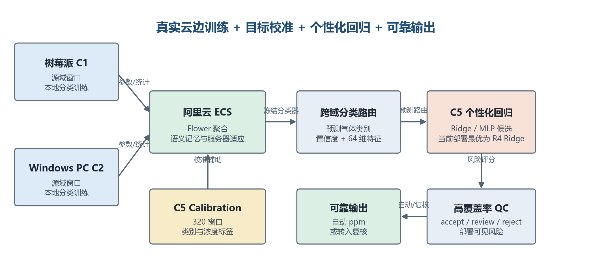
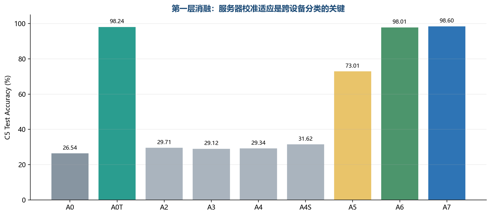
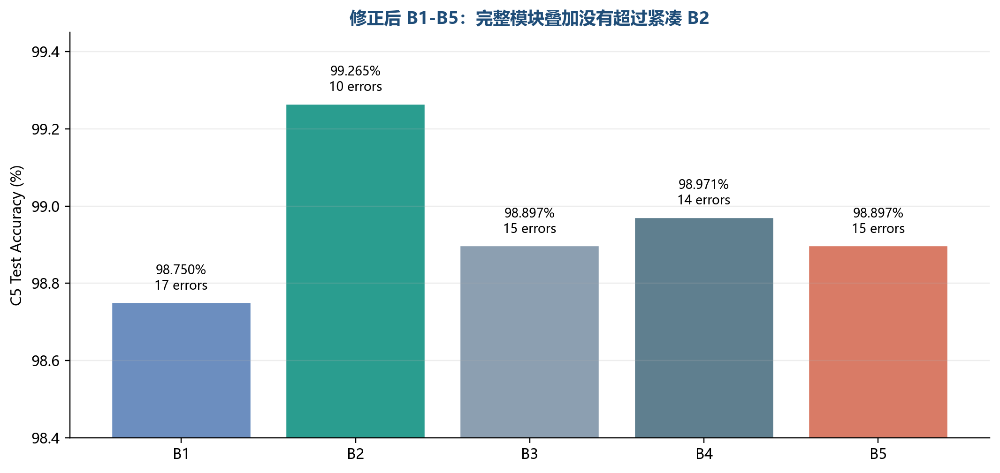
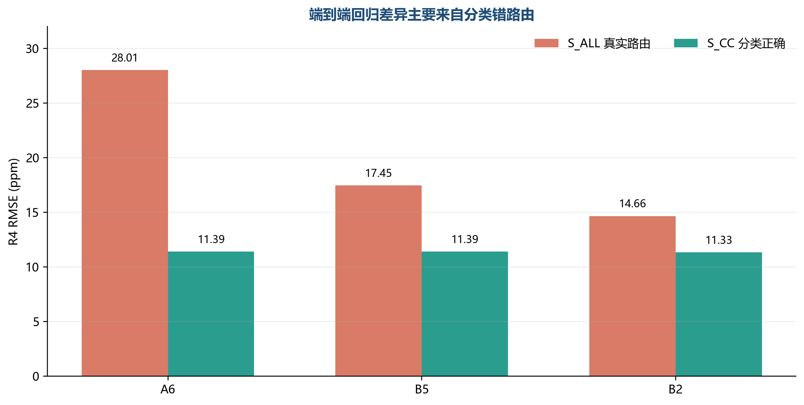
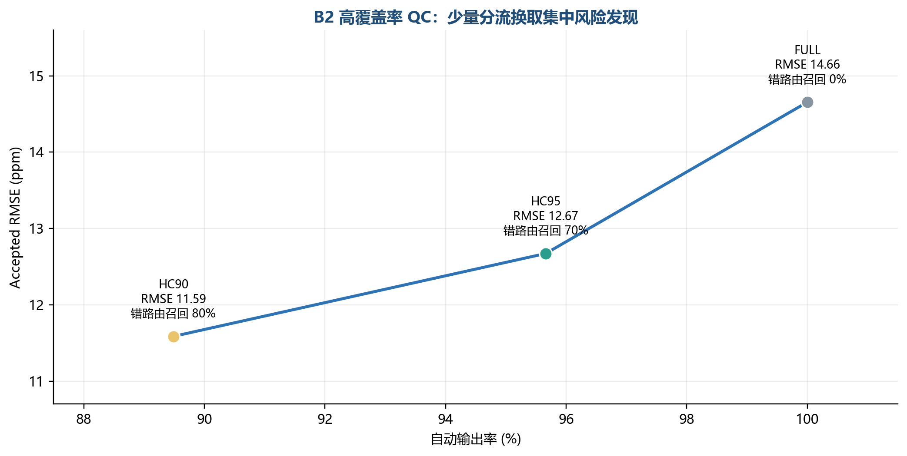

# GAPS 云边协同气体感知系统论文进展汇报

**用途：** 2026-07-14 导师汇报与 PPT 制作底稿
**主协议：** C1/C2 源域 -> C5 目标域
**实验拓扑：** 阿里云 ECS Flower 服务器 + 物理树莓派 C1 + Windows PC C2
**结果截点：** 2026-07-13；F1 单源跨方向实验中 B2 已完成，B5 仍在运行
**建议汇报时长：** 12-15 分钟，正文 11 页，附录按导师追问展开

> **一句话结论：** 目前已经完成一条可写入 IoT-J 系统论文的主闭环：真实云边联邦分类负责跨设备气体路由，C5 校准数据训练目标域个性化浓度回归，部署可见 QC 在保留约 95% 自动输出率时集中筛查高风险窗口。seed-42 结果显示紧凑 B2 优于完整 B5 的简单模块叠加，但 B2 是打开单种子排名后选出的候选，仍需配对多种子与跨方向实验确认。

## 一、明天建议重点汇报的四个结果

1. **系统闭环已经建立。** 分类、个性化回归和 QC 不再是互相分离的结果，而是按同一 C5 calibration/test 行键连接，并在 ECS、树莓派和 PC 的真实拓扑上完成分类训练，在 ECS 上完成正式回归与 QC 拟合。
2. **分类的关键不在堆叠全部域适应项。** A0 仅有 26.54% accuracy，A6/A7 达到 98.01%/98.60%；修正后的 B1-B5 中，紧凑 B2 达到 99.2647%，完整 B5 为 98.8971%。当前证据支持保留语义核心与 global/class MMD，不能证明 CORAL、阶段 MMD 和对抗项的叠加增益。
3. **端到端回归主要受分类路由错误影响。** 固定 H8 Ridge（R4）在 B2 下，全部真实路由窗口 S_ALL RMSE 为 14.6564 ppm；只看分类正确窗口 S_CC 为 11.3288 ppm。B2、B5 的 S_CC 几乎相同，而 S_ALL 差异明显，说明提升主要来自更少、破坏性更低的错路由。
4. **QC 能在高覆盖率下集中发现风险。** B2-HC95 自动输出 1301/1360 个窗口，自动输出率 95.66%，accepted RMSE 为 12.6729 ppm，并筛查出 7/10 个分类错路由；同等数量随机筛查平均只能发现约 4.02%。

## 二、建议 PPT 页序与逐页讲稿

### 第 1 页：研究题目与本次汇报目标

**标题建议：** 面向传感器域偏移的校准辅助云边协同气体感知系统

**页面只放：**

- 真实边缘节点联邦分类
- C5 目标域个性化浓度回归
- 高覆盖率风险筛查与可审计输出
- 本次回答：方法是否有效、哪些模块需要保留、论文还缺哪些证据

**讲稿：**

我们不再把工作包装成单一分类算法，而是一个从云边训练、目标校准、浓度估计到风险分流的完整感知系统。今天重点汇报三类结果：分类消融、个性化回归消融和 QC；最后说明目前哪些结论已经成立，哪些还需要多种子和系统实验补齐。

### 第 2 页：问题定义与论文故事

**核心问题：** 同一种气体在不同传感器、设备和时间条件下会产生明显响应偏移，源设备训练出的模型直接部署到新设备时，分类路由和浓度估计都可能失效。

**论文故事建议：**

1. C1/C2 在物理边缘设备上协同训练跨气体分类器。
2. ECS 利用少量 C5 calibration 数据进行校准辅助的服务器适应。
3. 分类器输出气体类别、置信度和 64 维特征，作为个性化回归的路由与输入。
4. C5 calibration 训练 Ridge/MLP 候选，最终由冻结规则选择部署回归器。
5. QC 只使用部署时可见信息，将结果分为 accept/review/reject。

**需要主动说明的边界：** 该方法使用了 C5 calibration 的类别和浓度标签，因此应称为 **calibration-assisted adaptation**，不能称为无监督域适应。

### 第 3 页：系统架构与数据协议

**固定协议：**

| 项目 | 设置 |
|---|---|
| 源域 | C1、C2；主训练使用 C1 train + C2 train |
| 目标域 | C5 only；C3/C4 不作为主目标域 |
| C5 calibration | 320 个窗口，4 类各 80 个 |
| C5 test | 1360 个窗口，4 类各 340 个 |
| 划分方式 | 窗口级、按类别和浓度均匀划分；导师已确认该协议可用 |
| 分类训练 | 25 轮；每轮本地 5 epochs；batch size 32；Adam LR 5e-4 |
| 服务器适应 | 每轮聚合后 100 个优化步；只使用 source/calibration 与 C5 calibration |
| 测试隔离 | C5 test 不参与训练、模型选择、融合权重或 QC 阈值选择 |

**讲稿重点：** 论文训练证据来自真实 ECS + 树莓派 + PC，不使用本地模拟替代。回归和 QC 在阿里云 ECS 上拟合，本地只做测试、命令生成、结果校验和文档整理。

### 第 4 页：分类方法到底训练了什么

**边缘客户端分类损失：**

\[
L_client = L_CE + 0.05 L_InfoNCE + 2.0 L_replay
\]

- `L_CE`：四类气体交叉熵。
- `L_InfoNCE`：类别-阶段语义约束，温度 `tau=0.1`。
- `L_replay`：从第 2 轮开始约束当前特征不要偏离上一轮模型。
- Flower 分类阶段明确关闭回归损失，不在客户端联合训练 ppm 回归头。

**服务器共同语义核心：** 类别-阶段 prototype、上一轮特征一致性、设备 residual 统计、GAPS 选择性聚合与服务器校准适应。

**B2 与 B5 的差别：**

| 配置 | 共同核心 | 额外分布项 |
|---|---|---|
| B2 紧凑候选 | prototype + replay + GAPS + semantic DA | global MMD2 0.5 + class MMD2 0.5 |
| B5 完整配置 | 与 B2 相同 | B2 + CORAL 0.5 + class-phase MMD2 0.2 + Wasserstein 0.5 |

**不能误解：** 如果 B2 后续优于 B5，只能说明 B5 额外增加的三项没有稳定叠加收益，不能说明 prototype、replay、GAPS 或 MMD 都没有用，因为它们是 B2/B5 的共同部分。

### 第 5 页：第一层分类消融说明了什么

| 组别 | C5 Accuracy | 作用解释 |
|---|---:|---|
| A0 | 26.5441% | 仅源域 CE/FedAvg，几乎不能跨越 C1/C2 -> C5 域偏移 |
| A0T | 98.2353% | 相同目标标签预算的监督校准基线，说明 C5 标签本身贡献很大 |
| A2/A3/A4/A4S | 29.12%-31.62% | 只在客户端加入 align/replay/selective aggregation 仍不足以跨域 |
| A5 | 73.0147% | 引入服务器适应后明显恢复，但语义结构仍不完整 |
| A6 | 98.0147% | 语义 prototype/residual 服务器适应是关键模块 |
| A7 | 98.6029% | legacy 完整配置略高于 A6，但仅高 0.59 个百分点 |

**稳妥结论：**

- 客户端局部正则本身不能解决大幅设备域偏移。
- 服务器使用目标 calibration 做语义适应是主要性能来源。
- A0T 与 A6/A7 接近，论文必须承认目标标签预算的重要作用，创新点不能只写成“域适应精度提升”。

### 第 6 页：修正后 B1-B5 分类消融

| 组别 | 新增项 | Accuracy | Macro-F1 | 错误数 |
|---|---|---:|---:|---:|
| B1 | CORAL | 98.7500% | 98.7534% | 17 |
| B2 | global/class MMD2 | **99.2647%** | **99.2657%** | **10** |
| B3 | cross-domain class-phase MMD2 | 98.8971% | 98.8980% | 15 |
| B4 | corrected Wasserstein | 98.9706% | 98.9714% | 14 |
| B5 | B1+B2+B3+B4 | 98.8971% | 98.8990% | 15 |

**当前结论：**

- seed 42 下，B2 的 accuracy、macro-F1、NLL 和 ECE 均最好。
- B5 没有表现出“模块越多越好”的简单叠加收益。
- 这支持把最终分类器向紧凑 B2 收缩，但还不能宣布 B2 为统计意义上的最终最优。

**证据等级：** B1-B5 是单种子筛选；B2 回归是在打开该排名后追加，因此属于 post-screen 探索性证据。最终结论需要 B2/B5 种子 43-46 的配对结果。

### 第 7 页：个性化浓度回归流程与消融含义

**回归与联邦分类是分阶段的。** 分类器先给出预测气体类别和特征；随后 C5 calibration 独立拟合目标域回归候选。目标域既有 Ridge，也训练了 MLP，但当前最优部署模型是 Ridge。

| 编号 | 模型/策略 | 作用与结论 |
|---|---|---|
| R0 | 冻结 C1/C2 R3aK16 | 只作 source reference，不是主回归器 |
| R1 | C5 rich-feature per-gas Ridge | 目标域 Ridge 基线 |
| R2 | C5 rich-feature per-gas MLP | H2.3 MLP anchor |
| R3 | MLP 与 reg-feature Ridge 融合 | H2.3+；权重只在 calibration-validation 选择 |
| R4 | H8 固定增强 Ridge | C5 Ridge + 三个 C1/C2 source-head 预测；关闭 C4 rescue |
| R5 | CO 用 R4，其余用 R3 | 固定按类别切换 |
| R6 | calibration-validation 风险门控 | 根据预测类别与风险选择 R3/R4 |
| R7 | 每个 test 样本选绝对误差更小者 | 使用 test 真值的不可部署 oracle 上界 |

**为什么最后是 R4：** B2 下 R4/R5/R6 的 S_ALL RMSE 分别为 14.6564/15.0080/15.4945 ppm，固定 H8 Ridge 最优。R7 的 12.6393 ppm 只能表示理论专家选择空间，不能写成系统性能。

### 第 8 页：回归结果揭示了真正瓶颈

| 分类骨干 | 分类错误数 | R4 S_ALL RMSE | R4 S_CC N | R4 S_CC RMSE |
|---|---:|---:|---:|---:|
| A6 | 27 | 28.0144 ppm | 1333 | 11.3890 ppm |
| B5 | 15 | 17.4473 ppm | 1345 | 11.3890 ppm |
| B2 | 10 | **14.6564 ppm** | 1350 | **11.3288 ppm** |

**两条主线必须同时汇报：**

1. **能力线 S_CC：** 分类正确时，当前浓度回归能力约为 11.33 ppm RMSE。
2. **实际系统线 S_ALL：** 使用预测类别真实路由、coverage=1 时，B2 当前为 14.66 ppm RMSE。

**关键解释：** B2 与 B5 的 S_CC 只差 0.0602 ppm，说明回归器本身几乎没有变强；B2 的 S_ALL 更好，主要因为错误路由从 15 个减少为 10 个，而且错误破坏程度更低。分类不是前置装饰，而是决定端到端回归长尾的路由层。

### 第 9 页：QC 如何在高覆盖率下工作

**部署可见风险只使用：** 分类置信度/熵、预测类别下的 prototype/support 距离、H2.3+/H8 分歧、source-head 离散度等。修改 `true_class` 或 `true_ppm` 不会改变风险或 QC 决策。

| 工作点 | Accept/Review/Reject | 自动输出率 | Nonreject 覆盖率 | Accepted RMSE | 错路由召回 |
|---|---:|---:|---:|---:|---:|
| FULL | 1360/0/0 | 100.00% | 100.00% | 14.6564 ppm | 0/10 |
| HC95 | 1301/35/24 | **95.66%** | 98.24% | **12.6729 ppm** | **7/10** |
| HC90 | 1217/119/24 | 89.49% | 98.24% | 11.5866 ppm | 8/10 |

**HC95 是论文主工作点：** 只把 4.34% 窗口转入 review/reject，就发现 70% 错路由；匹配数量的随机筛查平均只发现 4.02%。它同时发现 23/132 个高误差窗口，随机基线约 4.26%。

**表述边界：** QC 是风险分流，不是误差修复。accepted RMSE 只描述自动输出子集；review/reject 需要复测或人工处理，不能把它们当作已经得到正确浓度。

### 第 10 页：论文目前可以怎样包装

**建议题目方向：** Calibration-Assisted Cloud-Edge Collaborative Gas Sensing under Device Shift

**四个贡献点：**

1. **真实云边系统框架：** ECS、树莓派和 PC 上的联邦分类、目标校准、个性化回归和可靠输出统一在一个协议中。
2. **紧凑语义路由方法：** 类别-阶段 prototype、replay、可审计聚合与 global/class MMD2 共同处理跨设备分类偏移；完整叠加项作为负结果与复杂度论证。
3. **分类感知的目标域个性化回归：** 用 C5 calibration 比较 Ridge、MLP、融合与专家选择，证明分类路由质量主导端到端回归尾部。
4. **高覆盖率部署 QC：** calibration-only 阈值、部署可见风险、随机拒绝对照、accept/review/reject 与 runtime parity 构成可靠性闭环。

**论文主张应保持诚实：**

- 不把 calibration-assisted 写成 UDA。
- 不把 seed-42 B2 写成最终统计最优。
- 不只报 S_CC 或 QC 后低误差而隐藏 S_ALL、N 和 coverage。
- 不把不可部署 R7 oracle 写成实际系统性能。

### 第 11 页：当前进度、剩余工作与请导师决策

**已经完成：**

- 真实拓扑 A0-A7 和 B1-B5 seed-42 分类训练、回收与审计。
- MMD 再平方、stage 定义、prototype pair-L2 梯度和对抗符号问题的版本化修正。
- A6/B5 正式回归闭环与 B2 探索性重放。
- FULL/HC95/HC90、随机拒绝、truth-invariance 和 coverage 指标。
- 论文方法章节、代码文件介绍、经验笔记本和实验控制器。

**正在运行：**

- F1 C1 -> C5：B2 已完成并在 C5 test 上得到 98.8971% accuracy、98.8954% macro-F1、15 个错误；B5 正在物理树莓派 + ECS 上运行。

**下一阶段优先级：**

1. 完成 F1 B2/B5 配对，再按顺序运行 C5 -> C1、C4+C5 -> C1，判断额外 B5 模块是否跨方向稳定有益。
2. 对 B2/B5 补种子 43-46；报告均值、样本标准差、每个配对差和最差类 recall。
3. 对最终候选的多种子分类输出重放正式 R4 + QC，验证 S_ALL、S_CC、HC95 coverage 与错路由召回稳定性。
4. 完成 C5 回归/QC 低 calibration 预算实验，避免把固定分类器结果误写成端到端标签效率。
5. 补树莓派/PC 时延、内存、通信量、温度/降频和客户端掉线压力实验。
6. 修复并验证最终部署 bundle 缺策略/缺字段时 fail-closed，完成 offline/runtime parity。

**建议请导师确认的决策：**

- 若多种子和跨方向均显示 B2 不劣于 B5，是否同意把紧凑 B2 定为论文主方法，把 B5 作为“复杂模块没有稳定叠加收益”的消融证据？
- 论文创新重心是否明确放在“真实云边闭环 + 目标域个性化回归 + 高覆盖率可靠输出”，而不是强行强调复杂分类损失？
- 剩余实验中优先多种子稳定性，随后补系统开销和低校准压力，是否符合投稿节奏？

## 三、导师可能追问的问题与建议回答

### 1. 为什么 B2 比 B5 简单，反而更好？

B2 和 B5 都保留 prototype、replay、GAPS 与 semantic DA。B5 只是额外加入 CORAL、class-phase MMD 和 Wasserstein 对抗项。seed 42 下这些额外目标可能与已有语义约束产生优化竞争，因此没有形成叠加增益。当前只把它当作筛选现象，正在用跨方向和配对种子验证是否稳定。

### 2. 既然 A0T 已有 98.24%，分类方法还有创新吗？

A0T 证明 C5 calibration 标签预算是重要因素，所以不能把高精度全部归因于域对齐。分类部分的价值转为：在真实联邦拓扑中构建稳定路由、分析紧凑语义机制与复杂分布项、为后续个性化回归和 QC 提供可审计特征。论文的完整创新应由系统闭环、目标个性化和可靠性共同支撑。

### 3. 为什么主要回归器是 Ridge，不是 MLP？

目标域 calibration 只有 320 个窗口。系统实际训练了 per-gas MLP、Ridge 和融合候选，但在冻结的 calibration-validation 选择下，H8 增强 Ridge（R4）在 S_ALL 上最好，且更稳定、易部署。源域 MLP/Ridge 仍作为预测参考特征，但最终目标域输出不是由源域 MLP 直接给出。

### 4. 只报告分类正确时的回归会不会被质疑？

可以报告，但必须与真实系统线并列。S_CC 回答“回归器在正确路由条件下能做到什么”，S_ALL 回答“系统按预测类别实际运行能做到什么”。当前论文同时给出两者，并用错路由数量解释二者差距。

### 5. QC 是否只是丢掉样本换取更低误差？

不是简单按测试误差排序。风险与阈值都在 calibration-validation 上确定，测试时不读取真值；HC95 保留 95.66% 自动输出，仅转交少量窗口，同时错路由召回 70%，远高于同预算随机筛查约 4.02%。论文仍会完整报告 coverage、review/reject 数量和 FULL 基线。

### 6. 目前能否说论文实验已经完成？

主链路的 seed-42 闭环已经完成，可以写方法和阶段性结果；最终投稿证据尚未完全冻结。最重要的缺口是 B2/B5 多种子确认、跨方向配对、低 calibration 压力、系统开销以及最终 runtime fail-closed/parity。

## 四、可直接放进 PPT 的结果总表

| 证据线 | 当前最好可部署结果 | 结论等级 |
|---|---|---|
| 主协议分类 | B2：99.2647% accuracy，99.2657% macro-F1，10/1360 错误 | seed-42 post-screen 候选 |
| 正确路由回归 | B2-R4 S_CC：N=1350，RMSE 11.3288 ppm | seed-42 能力线 |
| 真实路由回归 | B2-R4 S_ALL：RMSE 14.6564，NRMSE 0.1059，MAE 7.4099 ppm | seed-42 探索性系统线 |
| 高覆盖率 QC | B2-HC95：95.66% 自动输出，accepted RMSE 12.6729，发现 7/10 错路由 | seed-42 探索性可靠性线 |
| 单源跨方向 | C1 -> C5 B2：98.8971% accuracy，15/1360 错误 | B2 已完成；等待同方向 B5 |
| 不可部署上界 | B2-R7 S_ALL：RMSE 12.6393 ppm | oracle，仅说明专家选择空间 |

## 五、汇报结束时的 30 秒总结

目前最重要的进展不是得到一个孤立的 99% 分类数字，而是已经证明分类路由、目标域回归和高覆盖率 QC 可以在真实云边系统中形成闭环。单种子结果显示，紧凑 B2 比完整 B5 更值得保留；回归结果进一步证明端到端误差主要受错路由长尾影响；QC 能在约 95% 自动输出率下集中发现大部分错路由。接下来用多种子、跨方向、低校准和系统开销实验把这条故事从阶段性结果提升为可投稿证据。

## 六、证据文件索引

- 分类 B1-B5：`results/iotj_classification_ablation_20260712_v3_summary/classification_per_run.csv`
- 分类 A0-A7：`results/iotj_classification_ablation_20260711_v2r1_summary/classification_per_run.csv`
- 正式回归/QC：`results/iotj_c5_formal_regression_20260713_v2_summary/formal_regression_report.md`
- 回归明细：`results/iotj_c5_formal_regression_20260713_v2_summary/r0_r7_comparison.csv`
- QC 明细：`results/iotj_c5_formal_regression_20260713_v2_summary/qc_operational_comparison.csv`
- 跨方向方案：`docs/superpowers/specs/2026-07-13-b2-b5-cross-direction-classification.md`
- 实验决策与风险：`docs/experiments/iotj_system_experiment_notebook.md`
- 系统方法原理：`docs/paper/iotj_system_methodology_20260711.zh.md`
