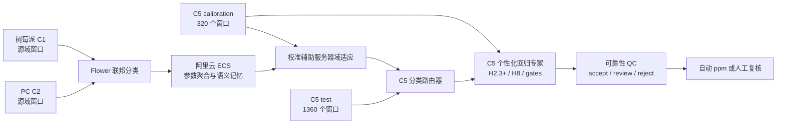

# GAPS 云边协同气体感知系统：原理与方法章节草稿

> 文档状态：论文方法章节中文底稿与代码审计说明。
>
> 对齐基线：仓库提交 `2424071`，冻结实验协议版本 `iotj_classification_ablation_20260711_v2r1`，审计日期 2026-07-11。
>
> 结果边界：本文件描述当前真实实现、数学定义和预注册实验口径，不把正在运行的 A0-A7 结果写成已验证结论。历史 F2 回放只用于工程校验，不进入新论文主结果表。

## 1. 方法定位

GAPS 面向异构金属氧化物气体传感设备的跨设备识别与浓度估计。系统不是一个同时端到端训练分类和回归的单一网络，而是由四个相互约束的阶段组成：

1. C1/C2 源设备在真实边缘节点上进行联邦分类训练。
2. 云端使用 C5 校准窗口进行带标签的服务器域适应，得到目标设备的分类路由器。
3. C5 使用少量校准窗口训练个性化的分气体回归专家。
4. 部署时根据预测类别、专家选择策略和 QC 风险输出浓度或转入复核。

因此，当前方法的准确名称应是：

> **面向云边协同气体感知的校准辅助、语义原型驱动、目标个性化联邦学习系统。**

它不是无监督域适应，也不能声称目标原始校准数据始终留在设备端。C5 的类别、阶段和浓度标签均参与服务器适应或目标端校准，服务器实验目录也持有 C5 calibration 数据。

## 2. 系统结构



训练拓扑为阿里云 ECS Flower 服务器、物理树莓派 C1 客户端和 Windows PC C2 客户端。论文性能表只接收这一真实拓扑产生的训练结果。本地执行仅用于单元测试、冻结产物分析、命令生成和数值等价性检查。

## 3. 问题定义与数据协议

### 3.1 样本与任务

第 $i$ 个窗口记为

\[
\mathcal{x}_i \in \mathbb{R}^{T\times S},\quad T=100,\ S=8,
\]

其气体类别、浓度、响应阶段和设备标识分别为

\[
y_i^{cls}\in\{0,1,2,3\},\quad y_i^{ppm}\in\mathbb{R},\quad
p_i\in\{0,1,2\},\quad d_i\in\{1,2,5\}.
\]

类别映射为 Ethanol、CO、Ethylene 和 Methane；阶段映射为 early、middle 和 late。分类器输出

\[
\hat y_i^{cls}=\arg\max_c \operatorname{softmax}(f_\theta(\mathcal{x}_i))_c,
\]

随后由类别条件回归头 $h_{d,\hat y_i^{cls}}$ 产生浓度候选。因此分类错误会把样本送入错误的气体回归头，是端到端误差放大的主要机制之一。

### 3.2 冻结数据角色

| 项目 | 冻结设置 |
|---|---|
| 源域客户端 | C1、C2 |
| 唯一目标域 | C5 |
| 不参与主目标协议 | C3、C4 |
| 数据根目录 | `dataset/client_data_c1234src_c5tgt_2080_timeaware_60_170_window_fullgrid` |
| C5 calibration/test | 320/1360 个窗口，20%/80% |
| C5 每类 calibration/test | 80/340 个窗口 |
| calibration 内层 fit/validation | 75%/25%，即每类约 60/20 个窗口 |
| 划分方式 | 按窗口、类别和浓度分层均匀划分 |
| 数据划分种子 | 42 |
| 训练种子 | 42、43、44、45、46 |

导师已确认窗口级分层切分可作为主协议。为避免窗口相关性导致置信区间偏窄，论文可在附录补充按文件或 repeat 聚类的 bootstrap，但不改变主切分。

所有分类、回归和 QC 流以 `(client, split, sample_index)` 为唯一键对齐。任何重复键、缺失预测、calibration/test 行交叉或使用 test 标签选择超参数的情况都应判为实验失败。

## 4. 联邦分类骨干

### 4.1 时序编码器

当前 Flower 分类路径实例化 `FedGasBaseModel`。输入先变换为 $B\times8\times100$，随后经过三个深度可分离 TCN 残差块：

| 层 | 通道 | 卷积核 | dilation | 归一化 |
|---|---:|---:|---:|---|
| TCN-1 | 8 -> 32 | 3 | 1 | affine InstanceNorm1d |
| TCN-2 | 32 -> 48 | 3 | 2 | affine InstanceNorm1d |
| TCN-3 | 48 -> 48 | 3 | 4 | affine InstanceNorm1d |

深度可分离卷积写为

\[
\operatorname{DSConv}(X)=\operatorname{PWConv}(\operatorname{DWConv}(X)),
\]

TCN 块为

\[
H_l=\operatorname{ReLU}\left(\operatorname{IN}(\operatorname{DSConv}_l(H_{l-1}))
+\operatorname{Proj}_l(H_{l-1})\right).
\]

InstanceNorm 消除单个窗口的通道统计偏移，适合批大小和设备分布不一致的边缘训练。

### 4.2 自注意力池化与分类头

TCN 输出恢复为 $B\times100\times48$，经 4 头自注意力：

\[
A=\operatorname{MHA}(H,H,H),\qquad
\alpha_t=\frac{\exp(w_a^\top A_t)}{\sum_{u=1}^{T}\exp(w_a^\top A_u)},
\]

\[
z^{pool}=\sum_{t=1}^{T}\alpha_t H_t,\qquad
z^{raw}=W_p z^{pool}+b_p.
\]

训练时加入标准差 0.01 的高斯特征噪声，并使用 0.1 dropout。分类特征归一化为

\[
z=\frac{z^{raw}}{\lVert z^{raw}\rVert_2},\qquad
o=W_cz+b_c.
\]

当前 checkpoint 序列化 22,765 个参数，其中真实分类前向使用 19,557 个。`channel_attn` 和未选用的 `feat_proj` 共 3,208 个参数属于历史兼容字段，不影响当前 logits，但仍参与 checkpoint 和参数通信。这是后续轻量化优化项，不能在正在运行的 v2 队列中途删除。

## 5. 客户端本地目标函数

### 5.1 分类交叉熵

客户端 (k) 的基础分类损失为

\[
\mathcal{L}_{ce}^{(k)}=-\frac{1}{|B|}\sum_{i\in B}
\log \operatorname{softmax}(o_i)_{y_i^{cls}}.
\]

当前主实验 label smoothing 和 focal gamma 均为 0，因此实际就是标准交叉熵。

### 5.2 类别-阶段语义原型

客户端在训练后切换到 eval 模式，并以未归一化的 64 维 `reg_feat` \(r_i\) 计算类别 \(c\)、阶段 \(p\) 的本地原型和对角方差：

\[
\mu_{k,c,p}=\frac{1}{N_{k,c,p}}\sum_{i:y_i^{cls}=c,p_i=p}r_i.
\]

服务器从第 2 轮开始广播已有语义原型。客户端将归一化分类特征 \(z_i\) 与原型在 InfoNCE 内再次 L2 归一化，将同类别同阶段原型作为正样本，其他原型作为负样本：

\[
\mathcal{L}_{align}^{(k)}=
-\frac{1}{|B_v|}\sum_{i\in B_v}
\log\frac{\exp(\operatorname{cos}(z_i,\bar\mu_{y_i,p_i})/\tau)}
{\sum_{c,p}\exp(\operatorname{cos}(z_i,\bar\mu_{c,p})/\tau)},
\]

其中 (	au=0.1)，有效权重 (lambda_{align}=0.05)。第 1 轮尚无服务器原型，所以含 alignment 的配置在第 1 轮仍退化为 CE 训练。

### 5.3 上一轮特征蒸馏

从第 2 轮开始，客户端冻结上一轮服务器模型 $f_{\theta^{t-1}}$，并约束当前特征：

\[
\mathcal{L}_{rep}^{(k)}=
\frac{1}{|B|}\sum_{i\in B}\left\lVert
z_i(\theta)-z_i(\theta^{t-1})\right\rVert_2^2.
\]

其权重为 (lambda_{rep}=2.0)。修复后的代码在第 1 轮只缓存输入服务器状态，不再错误地把当前模型当作“上一轮教师”。

### 5.4 客户端总损失

Flower 分类路径明确设置 `USE_REG_LOSS=False`，因此客户端不训练神经回归头。实际本地目标是

\[
\mathcal{L}_{client}^{(k)}=\mathcal{L}_{ce}^{(k)}
+\lambda_{align}\mathcal{L}_{align}^{(k)}
+\lambda_{rep}\mathcal{L}_{rep}^{(k)}.
\]

各消融 profile 的实际开关为：

| profile | CE | prototype alignment | replay distillation | device residual statistics |
|---|---:|---:|---:|---:|
| `ce_only` | 1 | 0 | 0 | 0 |
| `align_only` | 1 | 1 | 0 | 0 |
| `replay_only` | 1 | 0 | 1 | 0 |
| `align_replay` | 1 | 1 | 1 | 0 |
| `proto_replay` | 1 | 1 | 1 | 1 |

CE-only 和 replay-only 不再执行训练后的原型统计遍历，也不上传空的原型 JSON。只有语义 DA 组才计算设备残差，保证运行时间和通信量比较不被无用统计混入。

## 6. 参数聚合与语义记忆

### 6.1 FedAvg 与 GAPS 参数聚合

标准样本数加权为

\[
w_k=\frac{n_k}{\sum_j n_j},\qquad
\theta^{t+1}=\sum_k w_k\theta_k^{t+1}.
\]

当选择性聚合关闭、服务器 DA 关闭时，当前 GAPS 参数聚合与 FedAvg 数值等价。确定性合约测试在绝对误差 (10^{-7}) 内通过，因此 A1 只保留为实现合约，不重复进行完整训练。

### 6.2 原型 EMA

服务器先按客户端样本统计形成当轮未归一化特征空间中的类别-阶段原型 $\mu_{c,p}^{t,weighted}$，再更新长期语义记忆：

\[
\bar\mu_{c,p}^{t}=\rho\bar\mu_{c,p}^{t-1}
+(1-\rho)\mu_{c,p}^{t,weighted},\qquad \rho=0.8.
\]

首轮直接用当轮原型初始化。原型均值和对角方差均保存在轮次产物中。

### 6.3 选择性聚合

第 (k) 个客户端与服务器语义原型的一致性为

\[
s_k=\frac{1}{|\mathcal{K}_k|}\sum_{(c,p)\in\mathcal{K}_k}
\operatorname{cos}(\mu_{k,c,p},\bar\mu_{c,p}).
\]

调整后的权重为

\[
\tilde w_k=\frac{w_k\max(s_k,s_{min})}
{\sum_jw_j\max(s_j,s_{min})},\qquad s_{min}=0.3.
\]

v2 命令没有显式覆盖 `--selective-warmup`，真实生效值是服务器 CLI 默认的 3。因此第 1-3 轮使用 FedAvg 权重，第 4 轮起才允许选择性调整。

## 7. 校准辅助服务器域适应

### 7.1 数据流与命名边界

每轮参数聚合后，ECS 使用 C1/C2 calibration 作为源域 rehearsal 数据，使用 C5 calibration 作为目标域数据，执行 100 个 DA 优化步。目标 test 从不进入该过程。由于类条件 CORAL、类条件 MMD、对抗对齐、原型锚定和阶段项会读取 C5 类别或阶段标签，A5-A7 必须称为“calibration-assisted”或“label-assisted”，不能称为 UDA。

所有 DA 组保留源域分类 rehearsal：

\[
\mathcal{L}_{srcCE}=\frac{1}{M}\sum_{m=1}^{M}
\operatorname{CE}(f_\theta(x_m^s),y_m^s),\quad M\le 10\text{ batches}.
\]

A0T 额外使用目标交叉熵 $\lambda_{tCE}=1.0$，作为相同目标标签预算的监督校准基线；提出方法 A5-A7 的 $\lambda_{tCE}=0$。

### 7.2 类条件 CORAL

对特征维数 (d=64)，单类 CORAL 为

\[
\mathcal{L}_{coral}^{c}=\frac{\lVert C_s^c-C_t^c\rVert_F^2}{4d^2},
\]

代码对源域和目标域样本数均不少于 2 的类别取平均。

### 7.3 当前代码中的核分布项

基础函数使用固定 (sigma=1) 的高斯核并返回 biased empirical MMD-squared：

\[
\widehat D_{mmd}=\overline{k(X,X)}+\overline{k(Y,Y)}-2\overline{k(X,Y)}.
\]

当前 DA 调用又执行 `compute_mmd(...) ** 2`，所以真实优化项为

\[
\mathcal{L}_{gmmd}=\widehat D_{mmd}^{,2},\qquad
\mathcal{L}_{cmmd}=\frac{1}{|\mathcal C_v|}\sum_{c\in\mathcal C_v}
(\widehat D_{mmd}^{c})^2.
\]

这与通常直接优化 $\widehat{\operatorname{MMD}}^2$ 的写法不同。论文若报告当前 v2，必须按上式描述为“平方核差异项”，不能把代码直接写成标准 MMD。移除二次平方应作为冻结队列之后的独立修正版消融，不能中途替换。

### 7.4 语义原型与设备残差

对客户端 (k)，系统将本地原型分解为共享语义与设备残差：

\[
\mu_{k,c,p}\approx\bar\mu_{c,p}+r_k.
\]

当前代码中的拟合项为

\[
\mathcal{L}_{proto}=
\frac{1}{|\Omega|}\sum_{(k,c,p)\in\Omega}
w_kN_{k,c,p}\lVert\bar\mu_{c,p}+r_k-\mu_{k,c,p}\rVert_2^2.
\]

设备残差跟随客户端上传估计 $\hat r_k$：

\[
\mathcal{L}_{res}=\frac{1}{K}\sum_k\lVert r_k-\hat r_k\rVert_2^2.
\]

另有跨客户端同键原型一致性项：

\[
\mathcal{L}_{protoPair}=\operatorname{mean}_{c,p;k<j}
\lVert\mu_{k,c,p}-\mu_{j,c,p}\rVert_2^2.
\]

尽管代码字段沿用 `proto_mmd` 名称，该项实际是成对平方 L2，不是核 MMD。并且两端本地原型都已 `detach`，表达式不含可训练的语义原型或残差，所以当前项没有参数梯度，只是加到日志总损失中的常数诊断。不能把它写成已经改善模型更新的正则项。

源域特征还通过类别-阶段 InfoNCE 约束到服务器语义原型，形成 $\mathcal{L}_{cons}$。类中心锚定项为

\[
\mathcal{L}_{anchor}=\operatorname{mean}_{c}
\left(\lVert\mu_s^c-\bar\mu^c\rVert_2^2+
\lVert\mu_t^c-\bar\mu^c\rVert_2^2\right),
\]

其中 $\bar\mu^c$ 是类别 $c$ 的三个阶段语义原型均值。

### 7.5 当前 stage-MMD 的真实含义

当前实现不是“源域与目标域同阶段对齐”，而是在源域内部和目标域内部分别比较同类别的不同阶段：

\[
\mathcal{L}_{stage}^{current}=\operatorname{mean}_{d\in\{s,t\},c,p<q}
\left[\widehat D_{mmd}(Z_{d,c,p},Z_{d,c,q})\right]^2.
\]

它更接近阶段不变性正则，可能压缩早、中、晚阶段差异，与类别-阶段原型保留阶段结构的目标存在张力。A6 与 A7 的比较正好可以检验这一项。更符合故事的候选修正是

\[
\mathcal{L}_{stage}^{cross}=\operatorname{mean}_{c,p}
\widehat{\operatorname{MMD}}^2(Z_{s,c,p},Z_{t,c,p}),
\]

但该修正版尚未进入当前 v2 结果，不能提前写成已使用方法。

### 7.6 类条件域对抗

域判别器为 64 -> 32 -> 32 -> 1 的谱归一化 MLP。每个 DA 步执行 3 次 critic 更新，并使用系数 10 的 WGAN-GP；类条件模式只比较同类别的源/目标特征，GRL 系数为 1。

但当前符号组合需要特别审查。令

\[
W=D(Z_s)-D(Z_t).
\]

critic 最小化 \(-W+10GP\)，等价于增大 \(W\)。特征分支把 \(+W\) 接在 GRL 后再最小化；GRL 会反转梯度，使编码器的有效更新也倾向增大 \(W\)。因此当前实现不能直接解释成“缩小 Wasserstein 域差异”，且可能与预期域混淆方向相反。正在运行的 v2 保持原实现以保证矩阵一致性；后续需用 `A7-noADV` 和单独命名的符号修正版验证，论文不得在验证前声称该项完成了对抗域对齐。

### 7.7 服务器总损失与参数

\[
\begin{aligned}
\mathcal{L}_{server}={}&\mathcal{L}_{srcCE}
+\lambda_{coral}\mathcal{L}_{coral}
+\lambda_{gmmd}\mathcal{L}_{gmmd}
+\lambda_{cmmd}\mathcal{L}_{cmmd}\\
&+\lambda_{anchor}\mathcal{L}_{anchor}
+\lambda_{adv}\mathcal{L}_{adv}
+\lambda_{tCE}\mathcal{L}_{tCE}
+\lambda_{proto}\mathcal{L}_{proto}\\
&+\lambda_{cons}\mathcal{L}_{cons}
+\lambda_{res}\mathcal{L}_{res}
+\lambda_{protoPair}\mathcal{L}_{protoPair}
+\lambda_{stage}\mathcal{L}_{stage}.
\end{aligned}
\]

| 项 | A7 权重 |
|---|---:|
| CORAL | 0.5 |
| global squared kernel discrepancy | 0.5 |
| class-conditional squared kernel discrepancy | 0.5 |
| prototype class-center anchor | 0.3 |
| adversarial | 0.5 |
| target CE | 0.0 |
| semantic + residual prototype fit | 0.05 |
| source-to-prototype consistency | 2.0 |
| residual matching | 0.1 |
| cross-client prototype pair L2 | 0.2 |
| current intra-domain cross-stage term | 0.2 |

服务器优化器学习率为 $5\times10^{-4}$，每轮 100 步，DA warmup 为 0。源/目标 DA loader 每域最多固定抽取 500 个 calibration 窗口，batch size 32；C5 只有 320 个 calibration 窗口，因此全部进入 loader。critic 学习率为 0.001。`use_adapted_as_global=true`，因此适应后的参数直接成为下一轮全局模型。由此，强 DA 运行中的 `server_latest.pth` 不是独立 no-DA 模型；真正的 no-DA 基线必须单独训练。

## 8. 分类消融设计

| ID | 客户端 | 参数聚合 | 服务器适应 | 解释目标 |
|---|---|---|---|---|
| A0 | CE | FedAvg | 无 | source-only 联邦基线 |
| A0T | CE | FedAvg 等价 | source CE + target CE | 相同 C5 标签预算监督基线 |
| A1 | CE | GAPS、无 selective | 无 | 仅做数值等价合约，不完整训练 |
| A2 | CE + alignment | FedAvg 等价 | 无 | 原型对齐贡献 |
| A3 | CE + replay | FedAvg 等价 | 无 | 特征蒸馏贡献 |
| A4 | CE + alignment + replay | FedAvg 等价 | 无 | 客户端联合贡献 |
| A4S | A4 | selective GAPS | 无 | 选择性聚合贡献 |
| A5 | A4S | selective GAPS | distribution DA | CORAL/MMD/ADV 贡献 |
| A6 | A4S + residual stats | selective GAPS | semantic DA | semantic/residual 贡献 |
| A7 | A4S + residual stats | selective GAPS | full DA + current stage term | 完整配置 |

主训练固定 25 轮、本地 5 epochs、batch size 32、Adam LR $5\times10^{-4}$、梯度裁剪 5。先运行 9 个 seed-42 core 组；审查合理后，仅对 A0、A0T、A4、A4S、A5、A7 补齐 5 个种子。`A7-no*` 仅在 A7 确有增益时运行。

## 9. C5 个性化浓度回归

### 9.1 为什么分类和回归解耦

Flower 分类客户端没有回归损失。分类网络只提供预测路由、置信度和 64 维 backbone 特征。浓度估计在 C5 校准阶段独立完成，这样可以：

1. 不因目标设备的少量浓度标签反复重训联邦骨干。
2. 允许每种气体使用不同的目标校准头。
3. 将“分类路由能力”和“分类正确时的数值回归能力”分开审查。

R3aK16 只保留为 R0/source reference。其历史冻结结构使用每个传感器 16 个 DCT 系数的 response branch 和 depth-4 per-class 神经回归头，不使用 shared trunk 或 ratio branch。当前 C5 主线只复用其 C1/C2 checkpoint 生成基线 ppm/源参考特征，不重新把它作为目标域最终头训练。

### 9.2 104 维部署可见丰富响应描述

每个 100x8 窗口提取 104 个响应描述，包括：

- 每通道 mean、std、min、max、amplitude、slope、abs-difference mean/max，共 64 维。
- 全局幅值、波动、斜率与通道排序比例。
- 窗口时间、onset/t-min 相对位置、插值质量。
- response phase 和 early/middle/late one-hot。

分类骨干另导出 64 维 `cls_feat` 和 64 维 `reg_feat`。当前 H2.3 MLP anchor 使用 104 维丰富响应描述；H2.3+ 的弱 Ridge 候选使用 104 维描述加 64 维 `reg_feat`，共 168 维。

### 9.3 C5 Ridge

对每个目标气体分别标准化特征，并拟合不惩罚截距的 Ridge：

\[
\hat\beta_\alpha=(X^\top X+\alpha I_0)^{\dagger}X^\top y,
\]

其中 (I_0[0,0]=0)，(dagger) 为伪逆。候选

\[
\alpha\in\{0,0.01,0.1,1,10,100,1000\}
\]

只在 calibration-validation 上按 RMSE 选择，随后用完整 calibration 重拟合。预测裁剪到该气体校准浓度的最小/最大值。

### 9.4 C5 浅层 MLP 与 H2.3 anchor

每个气体独立训练 `MLPRegressor`：ReLU、LBFGS、`max_iter=800`、标准化输入。搜索空间为

\[
\text{hidden}\in\{(16),(32),(64),(32,16)\},\quad
\alpha\in\{0.001,0.01,0.1,1\}.
\]

每个头在真实类别对应的 calibration 行上训练和选择，在部署时按预测类别路由。这一 C5 per-gas MLP 是 H2.3 anchor。

### 9.5 H2.3+ 受约束融合

记 MLP anchor 为 (a_i)，rich + `reg_feat` Ridge 为 (r_i)，则

\[
\hat y_i(w)=(1-w)a_i+wr_i,
\]

\[
w\in\{0,0.1,0.25,0.5,0.75,1\}.
\]

仅当 calibration-validation 的整体 RMSE 改善，且 non-CO RMSE 相对 anchor 的退化不超过 1 ppm 时才允许 (w>0)；否则回退到 (w=0)。历史 F2 工程回放选到 (w=0)，说明复杂融合并不会被强制保留。

### 9.6 H8 源预测增强 C5 Ridge

H8 先在 C1/C2 上训练三个轻量 source reference：

1. 分气体 Ridge。
2. 分气体浅层 MLP。
3. 共享浅层 MLP。

然后把三者的 ppm 预测作为额外特征，与 C5 的 104 维响应描述共同输入目标分气体 Ridge。当前 H8 历史实现的 source MLP 搜索为 hidden `(16)`、alpha `{0.01,0.1}`；目标 Ridge alpha 使用完整 Ridge 网格。主协议明确传入 `--disable-c4-rescue`，不存在 C4 rescue。

### 9.7 专家选择

预注册候选包括：固定 H2.3+、固定 H8、预测 CO 即使用 H8 的简单 gate、P4 风险 gate，以及可靠性约束 selector。最终策略必须只用 calibration-validation 选择并冻结，之后才能打开 test 指标。

P4 的规则形式为

\[
g_i=\mathbf{1}[\hat y_i^{cls}=CO]\mathbf{1}[q_i\ge\tau],
\]

\[
\hat y_i^{P4}=(1-g_i)\hat y_i^{H2.3+}+g_i\hat y_i^{H8}.
\]

阈值候选由 validation 风险排序后的相邻中点及两端构成。约束为 non-CO RMSE 相对 H2.3+ 不退化超过 1 ppm；可行候选先最小化整体 RMSE，再偏好较低 H8 使用率和较高阈值。

当前历史 F2 P4 的 \(q_i\) 还不能视为严格部署可见风险：上游 `composite_response_risk` 使用 `true_class` 选择 ppm 量程后，才被 builder 重命名为 `risk_score`。在错路由 test 行上，这会间接使用真值类别。此外，离线 composite、QC composite 和最终 runtime 的归一化 risk ratio 曾共用 `risk_score` 名称。故历史 P4 仅是泄漏诊断，不能进入部署主表。正式 P4 必须先改用只依赖预测类别、logits、窗口响应和 calibration reference 的新字段，并完成 offline/runtime parity。

## 10. QC 与选择性输出

### 10.1 风险量

QC 模块设计的部署可见风险包括：

\[
q_{unc}=1-\max_c p_c,
\]

\[
q_{margin}=1-(p_{(1)}-p_{(2)}),
\]

\[
q_{conc}=|\hat y-\operatorname{nearest}(\mathcal{Y}_{cal})|/25,
\]

以及响应签名距离、类别响应排序风险、类别响应边缘风险。路由响应风险为

\[
q_{route}=\max(q_{rank},q_{responseMargin},10q_{unc}),
\]

综合风险取上述可用风险的最大值。

对选中的风险项和 calibration 阈值 (\eta_j)，定义

\[
R_i=\max_j\frac{q_{i,j}}{\eta_j}.
\]

若 $R_i\le r_{low}$ 则 accept，若 $R_i>r_{high}$ 则 reject，否则 review。代码默认 $r_{low}=0.9,r_{high}=1.1$，但这只是默认值，不是论文最终阈值。最终阈值必须由 calibration-validation 冻结。

运行时仅 accept 行自动给出 `auto_output_ppm`；review/reject 不产生自动 ppm，但保留 `final_ppm`、风险原因和专家来源用于审计。当前 `qc_policy.py` 在没有匹配策略、缺失风险分数或缺失阈值时存在 fail-open 行为，可能直接 accept；最终 C5 bundle 验证必须把 QC policy、calibration references 和必需风险字段设为强制项。

### 10.2 两条论文结果主线

定义

\[
S_{ALL}=\{i\},\qquad
S_{CC}=\{i:\hat y_i^{cls}=y_i^{cls}\},
\]

\[
S_{AR}=\{i:qc_i\in\{accept,review\}\}.
\]

论文必须分开报告：

1. **能力线**：先报告 C5 分类 accuracy/macro-F1/NLL/ECE，再报告 QC 之前的 (S_{CC}) 回归性能，回答“路由正确时浓度模型能做到什么”。
2. **系统线**：报告真实预测路由下的 (S_{ALL})，再报告 accept-only 和 (S_{AR}) 的误差、N 和 coverage，回答“实际系统可交付什么”。

(S_{AR}\cap S_{CC}) 只作为诊断，不得冒充纯 (S_{CC})。同时 (S_{CC}) 是条件性能，不能替代端到端主结果。

## 11. 评价指标

分类报告 accuracy、macro-F1、每类 recall、15-bin ECE、NLL 和 confusion matrix。回归报告：

\[
RMSE=\sqrt{\frac{1}{N}\sum_i(\hat y_i-y_i)^2},\quad
MAE=\frac{1}{N}\sum_i|\hat y_i-y_i|,
\]

\[
NRMSE=\sqrt{\frac{1}{N}\sum_i
\left(\frac{\hat y_i-y_i}{R_{y_i^{cls}}}\right)^2},
\]

其中类别量程为 Ethanol 112.5、CO 225、Ethylene 112.5、Methane 225 ppm。另报告 P90AE、Bias、(R^2)、N 和 coverage。常量标签切片的 (R^2) 记为空，不强行定义为 0。

五种子确认组报告均值、样本标准差、每个配对种子值以及相对 A7 的配对差。仅 5 个种子时，不夸大统计显著性；窗口指标可补充按文件/repeat 聚类的 bootstrap 作为稳健性分析。

## 12. 训练与推理算法

### 算法 1：云边协同分类训练

```text
输入：C1/C2 train，C1/C2 calibration，C5 calibration，轮数 T=25
初始化：分类参数 theta，语义原型集合为空
for round t = 1...T:
    ECS 向 C1/C2 下发 theta 和已有语义原型
    每个客户端执行 5 个本地 epoch：
        计算 CE
        若 t>=2 且有语义原型，计算 class-phase InfoNCE
        若 t>=2 且 profile 启用 replay，计算上一轮特征 MSE
        更新本地参数并按需提取 prototype/variance/residual
    ECS 用 FedAvg 或 selective GAPS 聚合参数
    ECS 用当轮统计更新 class-phase EMA 原型
    若该组启用 DA：
        在 C1/C2 calibration 与 C5 calibration 上优化 100 步服务器目标
        返回适应后参数作为下一轮全局参数
保存 round-25 最终 checkpoint、history、run_config 和哈希
```

### 算法 2：C5 个性化推理目标合同

下面是待最终候选冻结后必须实现的合同，不是对当前旧 `final_runtime.py` 已完成状态的描述。当前 runtime 仍加载旧 C12->C345/H8+C4 产物，尚未接入新的 C5 H2.3+/H8/selector policy。

```text
输入：C5 窗口 x，冻结分类器，冻结回归专家，冻结 QC 策略
1. 计算类别概率、pred_class、confidence、margin 和 backbone 特征
2. 按 pred_class 调用 H2.3+ 与 H8 对应气体头
3. 按 calibration-validation 冻结的专家策略选出 final_ppm
4. 从分类置信度、响应签名、浓度邻域和路由一致性计算风险
5. QC 给出 accept/review/reject
6. accept 才写 auto_output_ppm；其余保留审计字段
```

## 13. 当前代码审查发现与改进优先级

以下内容属于审查结论，不应伪装成已完成创新：

| 优先级 | 发现 | 对当前结果的含义 | 建议验证 |
|---|---|---|---|
| 高 | `compute_mmd` 已返回 MMD-squared，DA 又平方一次 | 项的尺度与梯度不同于标准 MMD | 当前 core 完成后增加 conventional-MMD 修正版，不混入 v2 |
| 高 | stage-MMD 是域内跨阶段对齐 | 可能抹平阶段结构，与 class-phase prototype 有张力 | 先看 A6 vs A7；再试同 `(class,phase)` 跨域 MMD |
| 高 | WGAN critic 与 GRL 特征项的当前符号都倾向增大 `D(source)-D(target)` | 不能声称现实现缩小 Wasserstein 差异 | 看 `A7-noADV`，再做单独的 adversarial-sign 修正版 |
| 高 | 历史 P4 composite risk 用 `true_class` 选择量程 | 错路由行的 gate 含真值泄漏 | 正式回归前重建 deployment-visible selector risk 并禁止 legacy fallback |
| 高 | 新 C5 专家/selector 尚未进入 `final_runtime.py` | 离线指标不等于可部署系统 | 冻结候选后接入双专家 artifact，并做 1360 行 `1e-6` parity |
| 高 | QC 缺策略/缺字段时 fail-open | bundle 不完整时可能错误 accept | bundle validator 强制 policy、references 和风险 schema |
| 中 | prototype fit 使用 `w_k*N_kcp` 后按项数平均 | 损失尺度随绝对样本数变化，lambda 可迁移性较弱 | 增加按总有效权重归一化的版本 |
| 中 | `proto_mmd` 的两端上传原型均已 detach，且不含 trainable variable | 权重 0.2 不改变模型或原型梯度 | 降级为离线诊断，或重写为作用于可训练表示的明确项 |
| 中 | 原型来自未归一化 `reg_feat`，但同时服务于 cosine 与 raw-L2 项 | 原型范数会影响 anchor/fit 的相对尺度 | 记录原型范数，并比较归一化 anchor 或独立原型空间 |
| 中 | 22,765 个序列化参数中 3,208 个不参与当前前向 | 通信和模型大小被历史字段放大约 14.1% | 最终策略冻结后做剪枝等价性与边缘 benchmark |
| 高 | C5 calibration 同时支撑 DA、回归和 QC | 合法但标签预算和过拟合风险必须透明 | A0T、公平标签预算表、低校准回归/QC stress |
| 中 | 每类 calibration-validation 约 20 行 | MLP/selector 排序可能方差较高 | 多训练种子、校准重采样、固定候选数 |
| 高 | 历史 P4 validation 改善但 test 弱于固定 H8 | 单风险阈值泛化不稳定 | 预注册固定专家和简单 gate，test 不参与选择 |
| 中 | 当前系统没有形式化 DP | 参数/统计上传不等于隐私保证 | 只声称联邦数据协同，不声称差分隐私 |

## 14. 论文创新点的稳健包装

当前最稳妥的贡献层次不是“堆叠多个损失”，而是完整系统闭环：

1. **校准辅助云边联邦感知框架**：在真实 ECS、树莓派和 PC 拓扑上，把跨设备分类、目标校准和部署输出统一为一个协议。
2. **类别-阶段语义记忆与可审计聚合**：用 class-phase prototype、上一轮特征蒸馏和 selective aggregation 分别处理语义漂移、遗忘和客户端贡献，并通过 A0-A7 因果消融拆开。
3. **分类路由感知的目标个性化定量**：将 C5 per-gas MLP、source-augmented Ridge 和校准约束 selector 放在同一行级协议下，明确区分 (S_{CC}) 能力与 real-route 性能。
4. **可靠性选择与 IoT 部署证据**：用风险-覆盖曲线、随机拒绝对照、runtime parity、树莓派时延/内存/通信和客户端可用性压力形成系统闭环。

故事必须由结果决定：

- 若 A7 稳定优于 A5/A6，可讲 distribution + semantic 的互补，但 stage 项仍需 A7-noStage 或修正版确认。
- 若 A6 优于 A7，应把阶段项降为负结果，主方法改为 semantic DA。
- 若 A5 最优，应把故事收敛到分布对齐与目标个性化，不强推语义项。
- 若 A0T 与 A7 接近，应承认主要收益来自目标标签，并把创新转向标签效率、回归个性化和可靠性闭环。
- 若所有 DA 均无稳定收益，分类部分作为系统路由基座，论文主贡献转向 C5 个性化回归、QC 和真实云边部署，不能制造不存在的分类增益。

## 15. 可主张与不可主张

### 当前可主张

- 主协议是 C1/C2 source -> C5 target。
- C5 calibration/test 是导师认可的窗口级类别/浓度分层 20%/80% 切分。
- Flower 分类路径不训练回归头；C5 回归使用目标校准 Ridge 和 MLP。
- A1 与 FedAvg 的 CE-only 参数聚合在合约测试中数值等价。
- 目标 test 不用于训练、模型选择、融合权重、专家阈值或 QC 阈值选择。
- 当前历史 F2 回放提示固定 H8 值得作为正式候选，P4 尚未获得主方法地位。

### 当前不可主张

- 不可称 A5-A7 为无监督域适应。
- 不可声称目标 calibration 原始数据从不离开 C5。
- 不可把 `server_latest.pth` 当作独立 no-DA 基线。
- 不可把历史 C3/C4/C5 或 F6 结果并入新的 C5-only 主表。
- 不可只报告 (S_{CC}) 或 QC 后低误差而隐藏 (S_{ALL})、N 和 coverage。
- 不可在多种候选看过 test 后再选择“最终方法”。
- 不可在五种子结果出现之前声称统计显著或稳定提升。
- 不可把历史 P4 `risk_score` 写成完全 deployment-visible，也不可声称新的 C5 selector 已被当前 runtime 使用。
- 不可在符号修正版验证前声称当前 adversarial 项缩小了 Wasserstein 域差异。
- 不可称当前卷积为 causal TCN、GRU-TCN 或通道注意力网络；卷积使用对称 padding，没有 GRU，已实例化的 `channel_attn` 未进入 TCN forward。
- 不可把无梯度的 `proto_mmd` 诊断写成已参与优化的核分布正则。

## 16. 实现映射

| 方法模块 | 主要代码 |
|---|---|
| 分类模型 | `model.py`, `utils.py:create_model_by_config` |
| Flower 客户端 | `gaps_flower/client_app.py`, `gaps_flower/task.py`, `client.py` |
| 聚合与语义记忆 | `gaps_flower/strategy.py` |
| 服务器域适应 | `gaps_flower/domain_adaptation.py`, `gaps_flower/server_app.py` |
| 消融命令与真实拓扑控制 | `scripts/generate_iotj_classification_ablation_commands.py`, `scripts/run_iotj_classification_cloud_edge.py` |
| 分类评估 | `scripts/summarize_iotj_classification_ablation.py` |
| C5 输入构建 | `scripts/build_iotj_c5_regression_inputs.py` |
| H2.3+ | `scripts/run_iotj_c5_h23_plus.py`, `run_h2_3_plus_fusion_profile.py` |
| H8 | `run_source_augmented_target_ridge_eval.py` |
| P4 | `scripts/select_iotj_c5_p4.py` |
| 回归指标切片 | `run_final_metric_consolidation_20260709.py` |
| QC | `gaps_deploy/qc_policy.py` |
| 实验冻结与经验记录 | `docs/superpowers/plans/2026-07-11-iotj-system-experiment-closure.md`, `docs/experiments/iotj_system_experiment_notebook.md` |

## 17. 参考原理来源建议

论文定稿时至少补齐以下原始文献，并按 IEEE 格式统一编号：FedAvg、Deep CORAL、kernel two-sample MMD、domain-adversarial learning、WGAN-GP、FedProx、selective prediction/risk-coverage。本文档中的公式以当前仓库实现为准；当代码与经典定义不一致时，正文必须优先描述真实实现，并把经典版本作为对照消融。

## 18. 2026-07-13 可执行方法修订

本节对应 `results/iotj_c5_formal_regression_20260713_v2` 的实际执行代码；与前文历史 P4、旧 `risk_score` 或风险最大值定义冲突时，以本节为准。

### 18.1 正式 R0-R7 回归阶梯

- R0：冻结的 C1/C2 R3aK16 source reference。
- R1：仅使用 C5 rich features 的分气体 Ridge。
- R2：仅使用 C5 rich features 的分气体浅层 MLP，即 H2.3 anchor。
- R3：由 calibration-validation 选择权重的 H2.3+，融合 R2 与 reg-feature Ridge。
- R4：固定 H8，即 C1/C2 Ridge、per-gas MLP 和 shared MLP 预测增强的 C5 Ridge，关闭 C4 rescue。
- R5：若预测类别为 CO 则使用 R4，否则使用 R3。
- R6：仅在 calibration-validation 上选择风险阈值；预测为 CO 且风险不低于阈值时使用 R4，否则使用 R3。
- R7：逐测试样本选择 R3/R4 中绝对误差较小者，仅作为不可部署 oracle 上界。

R6 的阈值和 R3 的融合权重均不读取 test 标签。R7 必须带有 `uses_test_truth_at_runtime=1`，其余 R0-R6 必须为 0。任一 R0-R4 预测缺失或非有限时，整套实验直接失败。

### 18.2 部署可见风险

所有原始风险只读取预测类别、阶段、分类概率、分类特征和专家预测。令 calibration-validation 上的经验百分位映射为 $F_k(\cdot)$，则

\[
q_{conf}=F_{conf}(\max(q_{entropy},q_{margin})),
\]

\[
q_{feat}=\frac{F_{proto}(q_{proto})+F_{support}(q_{support})}{2},
\]

\[
q_{dis}=\frac{F_{expert}(q_{expert})+F_{source}(q_{source})}{2},
\]

\[
q_{full}=\frac{q_{conf}+q_{feat}+q_{dis}}{3}.
\]

其中 prototype/support 距离按预测类别与阶段的 calibration reference 计算；H2.3+/H8 分歧和三个 source head 的离散度均按预测类别量程归一化。修改 `true_class`、`true_ppm`、正确性标志或误差列不得改变上述风险和 QC 决策。

FULL 全部 accept。HC95 的 accept/reject 阈值分别取 calibration-validation 风险的 0.95/0.9875 分位数；HC90 分别取 0.90/0.975 分位数。测试集只报告实际 accept/review/reject 数量与覆盖率，不强制达到名义比例。固定测试覆盖率曲线仅用于排序诊断，不属于可部署阈值。

令测试窗口总数为 $N$，则自动输出收益率和非拒绝覆盖率分别为

\[
Y_{auto}=\frac{N_{accept}}{N},\qquad
C_{nonreject}=\frac{N_{accept}+N_{review}}{N}.
\]

Accepted 指标衡量无需人工介入即可自动输出的窗口；Nonreject 指标在同一策略下合并 accept 与 review，衡量仅剔除明确 reject 后仍可保留的总体性能。两种口径都必须同时给出样本数、RMSE 和 NRMSE，不能只报告误差而隐藏覆盖率。

为分离分类路由误差与回归器数值误差，另构造仅用于诊断的 oracle-route 流：保留全部原始窗口和 QC 决策不变，只把回归路由设为 $\hat c_i^{oracle}=c_i$ 后重新计算 H8 预测。它不同于 $S_{CC}$：$S_{CC}$ 删除分类错误窗口，而 oracle-route 保留并重新路由这些窗口。因此 oracle-route 只表示“分类路由完全正确时”的离线上界，不可作为部署性能。

### 18.3 当前结果边界

预声明的 A6/B5 seed-42 对比支持“分类路由质量决定端到端回归尾部”的解释：A6 与 B5 在 S_CC 下的 R4 RMSE 都约为 11.389 ppm，但 B5 的分类错误从 27 条减少到 15 条，使 S_ALL R4 RMSE 从 28.014 降至 17.447 ppm。B5-HC95 实际自动覆盖率 96.25%，accepted RMSE 15.908 ppm，并标记 7/15 个分类错误。

B2 是在 B1-B5 分类 test 排名打开后追加的同流程下游重放，因此只能作为 post-screen 探索性证据。B2 有 10 条分类错误；固定 H8（R4）的 S_ALL RMSE 为 14.656 ppm，S_CC N=1350、RMSE 为 11.329 ppm。它与 B5 的 S_CC 差异仅 0.060 ppm，说明主要收益仍来自更少且破坏性更低的错路由，而不是正确路由回归器本身发生显著变化。R5 和 R6 分别为 15.008/15.495 ppm，均未超过 R4，故当前点估计应保留固定 H8；R7 的 12.639 ppm 只表示不可部署的专家选择上界。

B2-HC95 的 accept/review/reject 为 1301/35/24，实际自动覆盖率 95.66%，accepted RMSE 12.673 ppm；它标记 7/10 个分类错误和 23/132 个高误差窗口，而匹配随机拒绝的平均召回率分别为 4.02% 和 4.26%。这支持 QC 作为高覆盖率风险分流层，但不表示 QC 修复了被 review/reject 的预测。所有 B2/B5 优劣仍需种子 43-46 的配对确认，不得写成统计显著结论。

扩展后的 FULL oracle-route 在 A6/B5/B2 上均使用全部 1360 条 test 窗口，并得到相同的 RMSE/NRMSE `11.9082/0.0690`。相同结果验证了三组实验共享同一套 H8 回归训练，覆盖率 1 下实际路由 RMSE `28.0144/17.4473/14.6564` 的差异主要来自分类路由。B2-HC95 的 Nonreject N 为 1336（覆盖率 98.24%），实际路由 RMSE/NRMSE 为 `12.8614/0.0858`；Accepted N 为 1301（自动收益率 95.66%），对应 `12.6729/0.0857`。因此论文应同时呈现自动输出线与人工复核线，而不能把 review 隐含并入“拒绝”。
