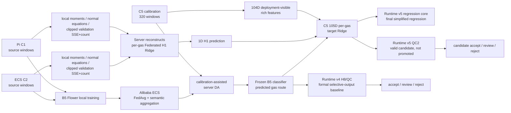

# GAPS 最终系统总览（2026-07-26）

> **CANONICAL CURRENT GUIDE**
>
> 状态：`NO_FURTHER_EXPERIMENTS_REQUIRED_FOR_CURRENT_SCOPE`
>
> 正式协议：`calibrated-target held-out-window evaluation`

## 1. 研究目标

GAPS 面向异构金属氧化物气体传感器的跨设备分类、浓度估计和可靠输出。系统把分类、源端回归参考、目标端个性化和选择性输出拆成可审计阶段，避免把不同训练边界和指标口径混成一个端到端模型。

## 2. 设备与数据角色

| 对象 | 角色 | 可读取数据 | 不应读取/上传 |
|---|---|---|---|
| C1 Raspberry Pi | source classifier client；H1 local sufficient statistics | C1 source train/calibration | C2/C5 raw rows |
| C2 ECS client | source classifier client；H1 local sufficient statistics | C2 source train/calibration | C1/C5 raw rows |
| Alibaba ECS server | Flower aggregation、server DA、H1 statistics aggregation | 模型更新、原型/统计、C5 calibration、H1 sufficient statistics | C1/C2 raw source rows、raw X/y、逐样本 source labels/predictions |
| C5 target | target calibration、105D Ridge personalization、held-out-window test | 320 calibration windows；冻结后的 1360 test windows | test labels 不得进入 fit/select/refit/QC threshold selection |

历史 calibration/test 先构造窗口，再按气体类别与浓度分层划分：

- calibration：320 windows；
- test：1360 windows；
- 同一个具体 window/sample row 不跨 subset；
- 同一原始文件的不同 windows 可以出现在两侧；
- 因此不是 original-file-independent evaluation。

## 3. 当前权威系统流程



## 4. B5 联邦分类与 server DA

正式 B5：

- source clients：C1、C2；
- target calibration：C5；
- 25 Flower rounds；
- 每个 client 每轮 5 local epochs；
- batch size 32；
- Client Adam，learning rate `5e-4`；
- server DA 每轮 100 steps，共 2500 steps；
- seeds 42–46 只改变 random seed。

server DA 使用 C5 calibration 标签，因此必须称为 `calibration-assisted server domain adaptation`，不能称为 zero-shot 或 unsupervised target adaptation。

## 5. Federated H1：两阶段充分统计量流程

H1 是四个气体独立的 104D source Ridge reference。

第一阶段：

1. C1/C2 分别计算 `n_i`、`sum_x_i`、`sum_x2_i`；
2. server 聚合并构建 global scaler；
3. server 把 global scaler 返回客户端。

第二阶段：

1. 客户端基于 global scaler 计算每个 alpha 的正规方程 `A_i=X_i^T X_i`、`b_i=X_i^T y_i`；
2. server 聚合正规方程并重构候选 Ridge；
3. 客户端返回 clipped validation SSE/count；
4. server 选择 alpha；
5. 聚合完整 source fit statistics，重构最终 global H1。

不上传：

- raw source rows；
- raw X/y 表；
- sample-level source predictions；
- sample-level source labels。

隐私边界：

- 当前不提供 secure aggregation；
- 当前不提供 differential privacy；
- sufficient statistics 仍可能泄露聚合信息，不能写成形式化隐私保证。

## 6. C5 105D target Ridge

每个 C5 window 生成 104D deployment-visible rich features，再附加 predicted route 下的 1D Federated H1 ppm：

```text
104D rich features + 1D H1 prediction = 105D
```

按 B5 predicted class 路由到四个 per-gas target Ridge。历史正式 seed42 使用 calibration 内部 240 fit / 80 validation 选择 alpha，锁定后在完整 320 calibration 上 refit；test 不参与 fit、selection 或 refit。

## 7. Runtime 和 QC 角色

| 对象 | 正式角色 | 当前结论 |
|---|---|---|
| Runtime v4 | formal selective-output baseline | 保留；包含 H1/H2/H3、H2.3 auxiliary 和已冻结 HC95/HC90 风险语义 |
| Runtime v5 regression core | final simplified regression implementation | B5 → Federated H1 → 105D target Ridge；320/1360 parity 通过 |
| Runtime v5 QC2 | valid candidate not promoted | 风险方向与 tail enrichment 有效，但 coverage 与 HC90 CO guards 未通过 |

HC95/HC90 都输出 `accept/review/reject`。只有 `accept` 行允许生成 `auto_output_ppm`。v4 与 v5 QC 的风险含义不同，不能互换 policy 或阈值。

## 8. 指标边界

- five-seed classification mean：分类稳定性；
- seed42 runtime classifier：部署资产身份；
- `S_CC`：仅分类路由正确行；
- `S_ALL`：全部 1360 test 行；
- accepted RMSE：QC accept 子集；
- yield：accept/N；
- group-aware 320 mean：post-freeze calibration-protocol sensitivity；
- historical seed42 H8：legacy 路线。

这些值不能合并为一个没有 scope 的“系统准确率”。

## 9. 当前停止边界

当前范围不再运行：

- 新训练；
- original-file-level retraining；
- FedProx/FedAdam/SCAFFOLD；
- multi-target reruns；
- 新 QC；
- 新 regression heads；
- runtime promotion 或阈值重选。

后续只进行论文叙事、英文翻译、图表整理、参考文献核验、IEEE LaTeX 转换和导师审阅。
