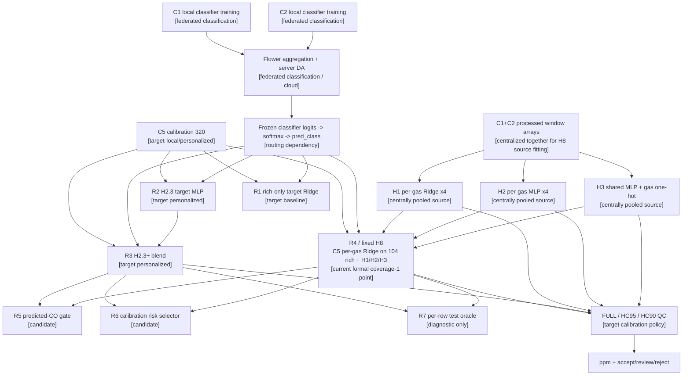

# GAPS C5 Regression Dependency Graph

审计日期：2026-07-17

审计性质：只读；未运行训练、未修改模型/loss/数据协议/回归头。
正式范围：`C1/C2 -> C5`，R0--R7 与 FULL/HC95/HC90。

## 1. 结论先行

- H1 source Ridge：四个 gas 各一个模型；每个模型把 C1 与 C2 的同 gas 窗口合并后集中拟合。
- H2 source per-gas MLP：同样是四个 pooled C1+C2 模型，不是每客户端各自模型。
- H3 source shared MLP：C1+C2 四个 gas 全部合并，在 rich features 后追加四维 gas one-hot，集中训练一个共享模型。
- H1/H2/H3 都没有 Flower/FedAvg/参数聚合。它们与 R0 的 `R3aK16_source_regression.pt` 是两条不同 provenance。
- 当前 formal R4/H8 把 H1/H2/H3 的三个 ppm prediction 全部加入 C5 target Ridge；三者均为结构性依赖，不只是报告用 baseline。
- 现有历史 deployment candidate 只在 enabled predicted-CO 分支调用 source augmentation；新的 C5-only final bundle 尚未冻结，因此不能把旧 runtime 直接称为 formal R4 runtime。

## 2. 当前正式链路

R0 是一条独立旁路：冻结 classifier 的 predicted route 输入既有的 `R3aK16_source_regression.pt`，得到 `baseline_final_ppm`。其 intended producer 是 C1/C2 分别本地训练后做 sample-weighted checkpoint FedAvg；formal input builder 只加载 checkpoint 推理，明确记录 `training_performed=false`。R0 不向 R4 提供参数或 prediction feature，但当前 input-builder 和旧 runtime plumbing 仍要求该 checkpoint；这是产物生成依赖，不是 R4 数值依赖。

## 3. R0--R7 实际依赖

| Ladder | 实际 prediction | classifier route | H1 Ridge | H2 per-gas MLP | H3 shared MLP | C5 target Ridge | C5 target MLP | 部署角色 |
|---|---|---:|---:|---:|---:|---:|---:|---|
| R0 | `baseline_final_ppm` from R3aK16 | 是 | 否 | 否 | 否 | 否 | 否 | source FedAvg reference/baseline |
| R1 | `target_ridge_rich_only_ppm` | 是 | 否 | 否 | 否 | 是 | 否 | target-only Ridge baseline |
| R2 | `h23_anchor_ppm` | 是 | 否 | 否 | 否 | 否 | 是 | target MLP anchor |
| R3 | `h23_plus_ppm` | 是 | 否 | 否 | 否 | 可能，取决于 blend weight | 是 | target candidate；formal B2/B5 weight=0 |
| R4 | `target_ridge_plus_source_preds_ppm` | 是 | **是** | **是** | **是** | **是** | 否 | 当前 formal fixed H8 |
| R5 | predicted CO 用 R4，否则 R3 | 是 | 条件依赖 | 条件依赖 | 条件依赖 | 条件依赖 | 非 CO/回退依赖 | candidate/baseline |
| R6 | calibration-selected risk gate | 是 | 条件依赖且参与 risk | 条件依赖且参与 risk | 条件依赖且参与 risk | 条件依赖 | 回退与 risk 依赖 | deployable candidate，未胜过 R4 |
| R7 | test truth 逐行选择 R3/R4 | 是 | 条件依赖 | 条件依赖 | 条件依赖 | 条件依赖 | 条件依赖 | oracle diagnostic only |

## 4. R4/H8 与 QC 的强依赖边界

`run_source_augmented_target_ridge_eval.py` 在 `SOURCE_PRED_KEYS` 中固定声明 H1/H2/H3；`attach_source_predictions()` 依次生成三列；`add_pred_features()` 把三列写入最终 target Ridge 的 feature dictionary。正式 B2 manifest 进一步记录 `rich_feature_count=104`、`augmented_feature_count=107`。

部署实现 `gaps_deploy/rich_residual.py::_source_aug_target_ridge_ppm()` 也依次计算三个 source prediction，并在任一结果缺失时返回 `None`。因此，就当前 H8 数学与 runtime candidate 实现而言：

- source Ridge：强依赖；
- source per-gas MLP：强依赖；
- source shared MLP：强依赖；
- 三者不是 R4 的 baseline/reference-only 节点。

但需保留两个边界：

1. 当前 final C5 deployment bundle 尚未构建，不能宣称旧 H8+C4/CO-gated candidate 已经实现 formal R4 全路由语义。
2. QC 的 `raw_risk_source_spread` 直接读取三种 source prediction，`raw_risk_expert_disagreement` 同时读取 H2.3+ 与 H8；即使最终 ppm 固定使用 R4，当前 operational QC 仍间接依赖 target H2.3 stream。
3. 当前 Git-tracked live package QC 在 rich-residual/H8 correction 之前运行，且不实现 formal high-coverage QC 的 H2.3/H8 disagreement 与 source-head spread。因此旧 `FinalDeployRuntime` 不是 formal C5 R4 + FULL/HC95/HC90 runtime。

## 5. 证据索引

- gas 映射：`run_regression_head_ablation.py:23-24`。
- pooled source row construction：`run_regression_head_ablation.py:169-199`。
- Ridge selection/refit：`run_regression_head_ablation.py:272-318`。
- per-gas/shared MLP 与 gas one-hot：`run_source_lightweight_regression_head_ablation.py:67-88,111-171,174-244`。
- formal source head fit/attachment：`run_source_augmented_target_ridge_eval.py:48-64,116-166`。
- target R4 fit/apply：`run_source_augmented_target_ridge_eval.py:375-456`。
- formal suite order：`scripts/run_iotj_c5_regression_suite.py:30-117`。
- R0--R7 assembly：`scripts/assemble_iotj_c5_regression_ladder.py:19-29,64-145`。
- QC source-spread and expert disagreement：`scripts/evaluate_iotj_high_coverage_qc.py:200-235`。
- runtime source-head requirement：`gaps_deploy/rich_residual.py:264-280,433-466`。
- legacy live runtime/QC ordering：`gaps_deploy/final_runtime.py:54-86,145-200`、`gaps_deploy/inference.py:766-868`。
